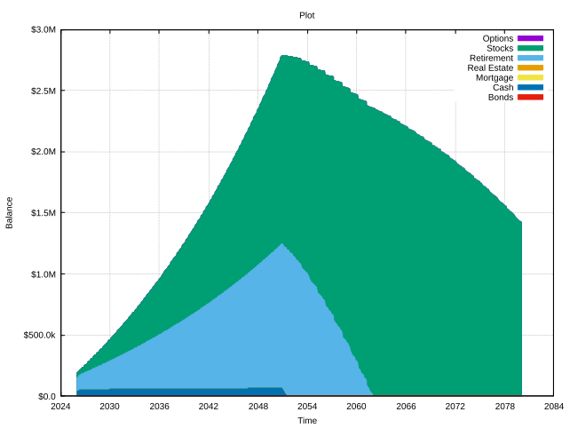
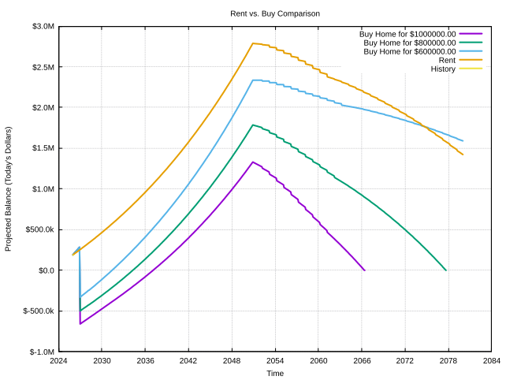
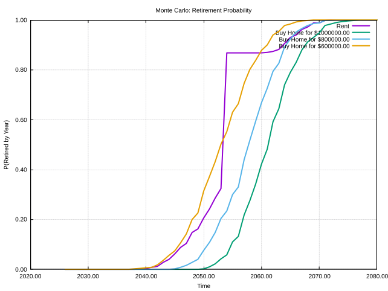

# Summary

Canni is an open source personal finance tool. 
It's meant to help get preliminary estimates to financial questions to help focus sessions with a 
professional financial planner. You can think of it much like you would as an initial gut check or napkin math: 
it can be a decent start, but it shouldn't be treated as the end of the story. 

# Setup

**Prerequisites**: a C++23-capable compiler (Clang 16+ or GCC 13+), CMake 3.20+, and optionally gnuplot for plots.

e.g. on macOS with Homebrew:
```sh
brew install cmake gnuplot
```

**Build**:
```sh
git clone <repo-url> && cd canni
cmake -B build -DCMAKE_BUILD_TYPE=Release
cmake --build build
```

**Run the examples** (from the `build/` directory, so relative CSV paths resolve correctly):
```sh
cd build
./BasicPortfolio    # salary + housing scenario comparison
./OptionsPortfolio  # equity compensation with Monte Carlo
```

**Run the tests**:
```sh
cd build && ctest --output-on-failure
```

# Features

### Month-to-month financial projections based on event-driven financial simulation.

```c++
MyFinances finances(kBase, rent(3000_USD));
finances.project();
stacked_plot(finances.grouped_totals());
```



### Plotted scenario comparisons (`canni/tools/Compare.h`).

```c++ 
compare<MyFinances>(kBase, {
    rent(3000_USD),
    buy_home(kToday + 12_months,  600000_USD, mortgage),
    buy_home(kToday + 12_months,  800000_USD, mortgage),
    buy_home(kToday + 12_months, 1000000_USD, mortgage),
}, {
    .title   = "Rent vs. Buy Comparison",
    .y_title = "Projected Balance (Today's Dollars)"
});
```



### Monte Carlo simulation (`canni/tools/MonteCarlo.h`).

```c++
const auto sims = monte_carlo_comparison<MyFinances>(kBase, {
    buy_home(kToday + 6_months, 600000_USD, mortgage),
    buy_home(kToday + 6_months, 800000_USD, mortgage),
    buy_home(kToday + 6_months, 1000000_USD, mortgage),
    rent(3000_USD),
}, kConservative);
xy_plot<I64, double>(sims, {
    .title   = "Monte Carlo: Retirement Probability",
    .y_title = "P(Retired by Year)"
});
```


    

# Caveats

You should never make financial choices based solely on the output of this tool! 
While no one can truly predict the future, this tool in particular is provided as-is, and makes 
no guarantees on accuracy. Latent modeling bugs can potentially bias estimates significantly. 

Parts of this codebase's source and test files were produced using Anthropic's Claude (Sonnet 4.6).
